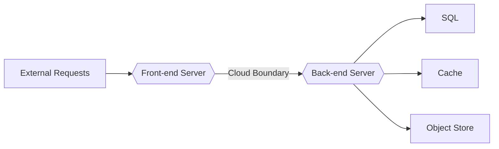

<!--
 Copyright (C) 2022 Code for Vegas Foundation
 
 This file is part of be-smart-calendar-server-py.
 
 be-smart-calendar-server-py is free software: you can redistribute it and/or modify
 it under the terms of the GNU General Public License as published by
 the Free Software Foundation, either version 3 of the License, or
 (at your option) any later version.
 
 be-smart-calendar-server-py is distributed in the hope that it will be useful,
 but WITHOUT ANY WARRANTY; without even the implied warranty of
 MERCHANTABILITY or FITNESS FOR A PARTICULAR PURPOSE.  See the
 GNU General Public License for more details.
 
 You should have received a copy of the GNU General Public License
 along with be-smart-calendar-server-py.  If not, see <http://www.gnu.org/licenses/>.
-->

# Smart Calendar Server Platform

The *Calendar Server* project, owned by Apple Computer and published under a liberal open source license (see Reference below), is one starting point for the Smart Calendar Server, thus python is also a starting language and, with a sufficiently large set of options for working with vcalendar and other related data and protocols already available.

The Calendar Server project made use of the Twisted asynchronous web framework to handle requests. It will be possible to use Twisted, or Tornado, or perhaps AWS Lamda functions or other to handle large traffic bursts, to be expected during calendar syncs across multiple endpoints. Apple is no longer supporting the Calendar Server project, it has been archived, and is long out of date concerning python versions, etc, so useful for ideas, perhaps, and documentation references. Linked in References section below.

As well there is a more current project, Radicale (see References below) which offers some interesting ideas, also written in python.

Both of these projects are interesting, but should only be taken as inspiration to start the SmartCalendar-Server effort. As well, Radicale may be useful for testing server peering and feature parity checks.

The latest available version of Python that may be used in these scenarios (3.9+) without support for any previous or legacy (2.7 or older) python versions.

Ideally the core services will be deployable as a Serverless Lambda (or other) function, behind an async server, behind something like Django or FastAPI, or perhaps exposed as a server callable behind a Node or GoLang web server. It is possible that the architecture of this implementation will be a candidate for refactoring into another language entirely.

There is a Javascript representation of iCalendar data structures out there, it could be on The List to support, especially if Smart Calendar begins down a path of extension.

## Early Implementation and Initial Choices

The first pass at a Smart Calendar Server is implemented using

- Python 3.10+
  - Pydantic data models
  - dataclasses for internal data representation
  - pytest for Test Driven Development
- SQL Database (for more detail visit the db-smart-social-sql project repository)
  - Likely PostgreSQL as part of a Smart Social data model implementation
  - Schema isolation
  - Stored function access to data tables (indirect INSERT and UPDATE through the SELECT calling mechanism)
  - Data model adapters via python dataclasses
- Split server implementation
  - Front-side access via outside client(s) and peer servers to CalDAV and Smart Calendar endpoints
  - Back-side implementation may be isolated outside bastion configuration, or in a completely separate cloud account or service
  - Front-side interactions are relayed to Back-end which interfaces with backing data store and any other services
  - Front-end and Back-end servers are the same implementation with parametric configuration for each of these roles in the workflow

Illustrating of the Split Server implementation:

## External References

[Calendar Server](http://www.calendarserver.org)

[Radicale](https://radicale.org/v3.html)
